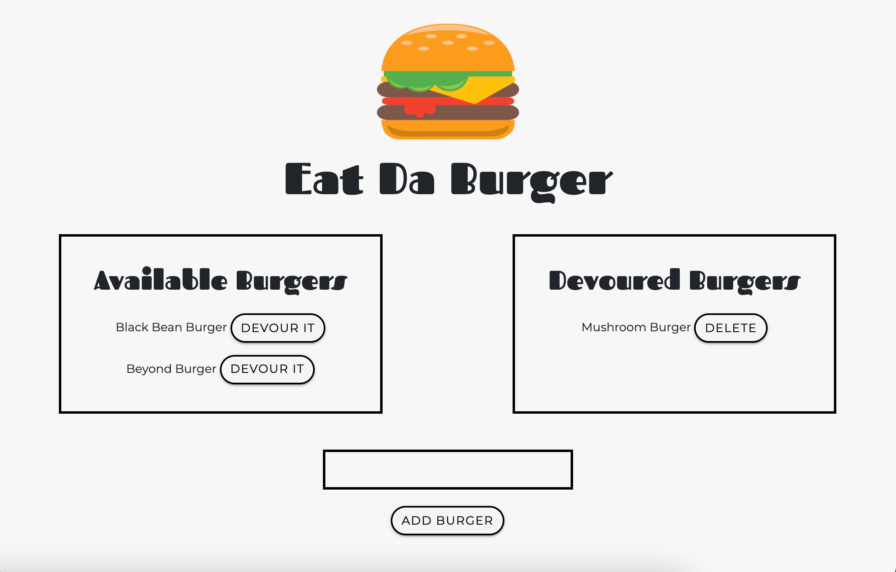

# Eat-Da-Burgers

## Project Description

This node.js restaurant application allows users to keep track of a tasty burger menu.

## Deployed Application
* https://pure-badlands-79583.herokuapp.com/
* https://github.com/carlypeyton/Eat-Da-Burger

## Installation Instructions
Install the following npm packages prior to deploying application:
* express
* express-handebars
* mysql